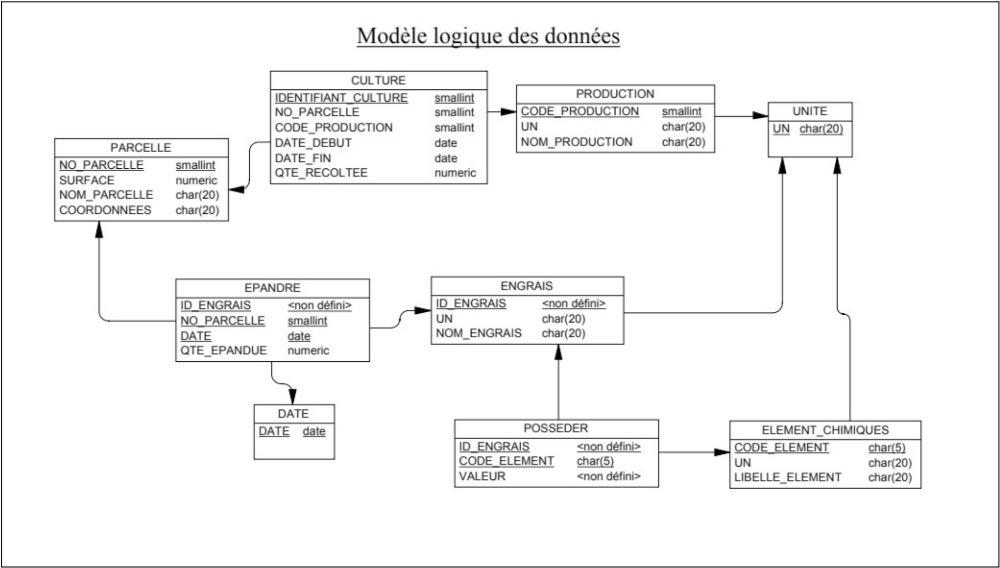
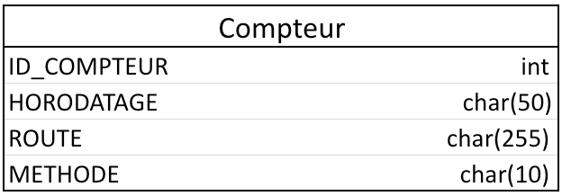

# Projet API – Backend

## Database

 
#### Schema de la base de données

---

#### Table Compteur 

## Description

Ce projet consiste en la création d'une API permettant à un Frontend d'exploiter une base de données 
destinée à gérer les rendements des parcelles d'une exploitation agricole.

## Objectif

L'objectif principal de ce projet est de fournir aux Frontend d'accéder et de manipuler les données de la base de données agricole.

## Routes

| Routes                | Methodes                      |        
|-----------------------|-------------------------------|
| /api/culture          | POST, DELETE, GET, PUT, PATCH |
| /api/production       | POST, DELETE, GET, PUT, PATCH | 
| /api/parcelle         | POST, DELETE, GET, PUT, PATCH | 
| /api/epandre          | POST, DELETE, GET, PUT        | 
| /api/date             | POST, DELETE, GET             | 
| /api/engrais          | POST, DELETE, GET, PUT, PATCH | 
| /api/posseder         | POST, DELETE, GET, PUT        | 
| /api/element_chimique | POST, DELETE, GET, PUT, PATCH | 
| /api/unite            | POST, DELETE, GET             | 
| /api/compteur         | GET                           |

Pour d'autres informations, consultez le Miro

---

### Token

| Route           | Methode |
|-----------------|---------|
| /api/auth/jwt   | GET     |

## Liens

#### Miro : https://miro.com/app/board/uXjVNcPF3u0=/?share_link_id=274411522119

---

#### Trello : https://trello.com/invite/b/SBPUChQp/ATTI29b5c2957931f500bb3276edf9dc5b9a5D4483F3/projet-api

---

#### Postman : https://app.getpostman.com/join-team?invite_code=7259258bca781123637e3f034810580d&target_code=cf68b552ebe9cdafdbf41a1e4d8b6076

## Lancement du projet

